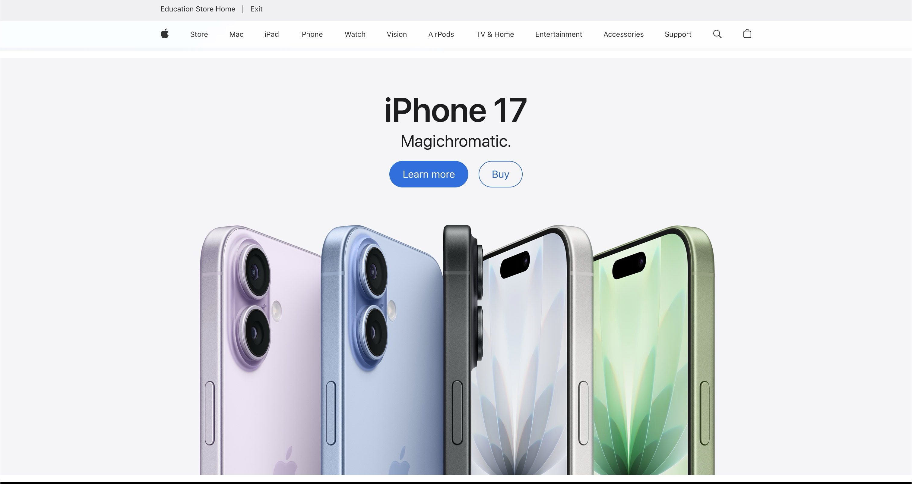
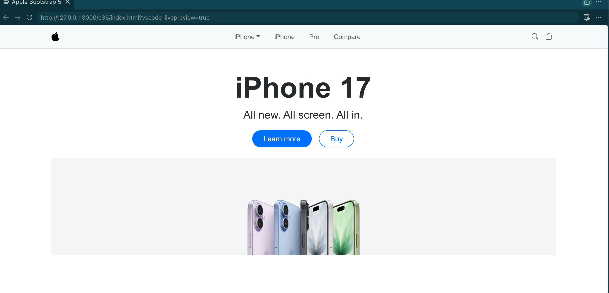

# UI Frameworks: Clear, Consistent, Concise

**ICS 314 — E37 Reflection | Dennis Sarsozo | July 2026**

---

UI frameworks are not simple. Honestly, learning something like Bootstrap 5 or Tailwind CSS can feel almost like learning a new programming language. There are class names, breakpoints, layout rules, component patterns, and a bunch of conventions that do not feel obvious the first time you see them.

So the fair question is: why bother?

Why not just use raw HTML and CSS? What do you actually get back for the time and frustration of learning a framework?

My answer is simple: you get something that just works. More importantly, you get a way to build interfaces that are clear, consistent, and concise without rebuilding every design decision from scratch.

Here is the comparison I kept thinking about while writing this: the real Apple homepage, then the Bootstrap 5 version I built for an assignment. Mine is obviously not Apple-level design, but that is exactly the point. With a framework, I could get close to the structure, spacing, nav, hero text, and button layout without building every detail from zero.

<div class="row g-3 my-4 align-items-start">
  <div class="col-md-6">
    <figure class="m-0">
      
      <figcaption class="text-muted small mt-2">The real Apple homepage, scrolled to the iPhone 17 hero section.</figcaption>
    </figure>
  </div>
  <div class="col-md-6">
    <figure class="m-0">
      
      <figcaption class="text-muted small mt-2">My Bootstrap 5 rebuild from the assignment.</figcaption>
    </figure>
  </div>
</div>

Funny enough, this essay itself proved the point after I published it. The first version used normal Markdown image syntax, so the screenshots showed up way too large on the live site. The fix was exactly the kind of thing I am arguing for here: use Bootstrap's responsive grid, put the screenshots in columns, and add `img-fluid` so the images resize correctly on desktop and mobile. I used Bootstrap to fix my essay about why Bootstrap is useful. That is pretty much the whole argument in one bug fix.

## HTML Is Structure, CSS Is Styling

Raw HTML and CSS are still the foundation. HTML is basically how you structure information on a page. It is how you make the document. CSS is how you make it look better. It is the styling layer.

That sounds simple, but actually making a page look good is not simple. Centering a div, making the layout responsive, choosing spacing that feels balanced, handling mobile breakpoints, and making sure the page does not fall apart on different screen sizes can get annoying fast.

I do not expect most people to know good design off the top of their head. That is why designers exist. Good design usually comes back to the three C's: clear, consistent, and concise. A page should be easy to understand, it should feel predictable, and it should not waste space or attention.

That is where UI frameworks help.

## Frameworks Package Other People's Design Work

The biggest benefit of a UI framework is that it abstracts away a lot of decisions that are easy to underestimate.

What is the proper breakpoint for a tablet? How should a layout collapse on a phone? What spacing should a navbar use? How should buttons, cards, rows, and columns behave so the page feels like one system instead of a random pile of elements?

With raw CSS, you have to think through all of that yourself. With Bootstrap 5, a lot of those decisions are already built into the framework. You use the grid system, the responsive utilities, and the components, and you get a page that is already closer to something usable.

That does not mean Bootstrap magically makes you a designer. You can still make ugly websites with a framework. But it gives you guardrails. It gives you defaults that were thought through by people who spent more time on accessibility, layout, responsiveness, and common web patterns than I probably want to spend on every class assignment or side project.

I do not even know how the people maintaining these frameworks get paid. Different story. But I am glad they exist.

## Bootstrap, Tailwind, And Not Starting From Zero

I have used Bootstrap 5 before for a work project, and I use Tailwind CSS for some personal stuff. I like both, even though they feel different.

Bootstrap feels like a full kit. You get components and layout patterns that are already opinionated. Tailwind is more utility-first. You are still writing a lot of class names, but those class names let you build exactly what you want without leaving the HTML as much.

That is one thing I really like: less context switching.

Instead of jumping back and forth between an HTML file and a separate CSS file for every small visual change, I can often stay in the HTML and say what I want with classes. If I want three columns in a row, I can express that directly:

```html
<div class="row">
  <div class="col-md-4">First section</div>
  <div class="col-md-4">Second section</div>
  <div class="col-md-4">Third section</div>
</div>
```

That is not magic, but it is practical. Once you learn the class names, the framework becomes a shared language. You can look up what you need, apply the class, and keep moving.

## The Raw HTML Version Works, But It Feels Old Fast

There is still value in building pages with plain HTML and CSS. In class, we made a page that looked like a book. It was a good exercise because it forces you to understand the basics. You learn how the structure works. You learn what CSS is actually doing.

But did it look modern? Not really. It looked pretty basic, like an old-school website.

That is not always bad. Sometimes basic is fine. But if the goal is to build something polished, responsive, and easy to scan, a framework helps a lot. If I rebuilt that kind of page with Bootstrap or Tailwind and added the right spacing, layout, and maybe some clean visual hierarchy, it would probably look a lot better without requiring me to hand-roll every single style rule.

The Apple.com-style Bootstrap page I made is a good example. I was not recreating Apple's entire design system from scratch. I was using the framework to get close to the structure and feel faster. That is the point. UI frameworks help you start from a working system instead of a blank page.

## The Investment Is Worth It

The frustrating part is real. When you are first learning a framework, it can feel like extra work. You already know HTML and CSS, and now you have to memorize another layer of class names and rules.

But after the learning curve, the payoff is real too.

You get faster layout. You get mobile-friendly behavior without manually writing every media query. You get consistency across pages. You get components that follow common web patterns. You get a vocabulary that other developers understand.

Most importantly, you avoid starting from scratch every time.

Raw HTML and CSS are clunky when you are trying to build modern interfaces quickly. UI frameworks are not perfect, but they are useful. Bootstrap 5, Tailwind CSS, and similar tools help turn messy design decisions into repeatable patterns.

That is why I think they are worth learning. They make it easier to build pages that follow the three C's: clear, consistent, and concise. And that is usually what good UI comes down to.

---

## A Note on AI Use

I used Codex and Gemini through OpenRouter to transcribe my audio notes and help turn them into this draft. I reviewed and edited the content to keep my own views and writing style. AI also pointed out a formatting issue in the Markdown workflow and helped me fix it so the essay matched the rest of my TechFolio essays.

The bigger thing I realized while working on this is that AI is always going to be another tool. You would not expect a landscaper to refuse to use a lawn mower if that is the best tool for the job. Same idea here: I would not expect a serious software engineer to refuse to use AI just to prove a point. The skill is knowing when to use the tool, how to steer it, and how to verify the result. That is probably another essay for another time.

---

*Written for ICS 314, Software Engineering I. University of Hawaiʻi at Mānoa, Summer 2026.*
