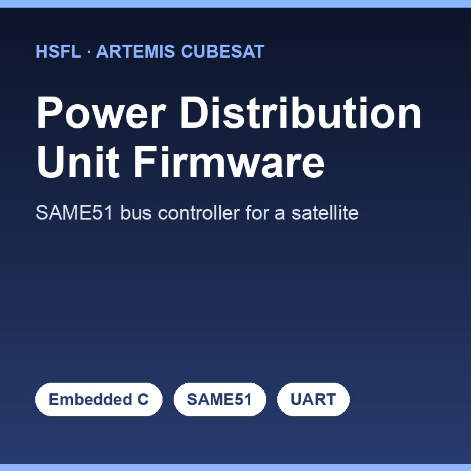

The Power Distribution Unit (PDU) is the part of a CubeSat that decides what gets power and when. This project is the flight-software layer that runs on the PDU's SAME51 microcontroller, built as an MPLAB X / Harmony v3 project. It does three things on purpose and nothing more: bring the system up and run the main loop, handle incoming UART commands, and feed the watchdog. Keeping the firmware that focused is what makes it straightforward to review and flight-qualify — important when this code controls power to the rest of the spacecraft.

I organized the firmware into clearly separated files so each concern is isolated: `main.c` for bring-up, `app.c` for the run loop and command handling, and `pdu_packet.c/.h` for the binary command-and-telemetry protocol. The protocol supports three op-codes — `PING` for a liveness check from the ground station, `SET_SWITCH` to turn individual 3V/5V/12V rails, VBATT, burn-wires, or torque-coil H-bridge legs on and off, and `GET_SWITCH_STATUS` to read every switch's latch state back for telemetry. All the GPIO manipulation lives in one place, so the hardware control is cleanly separated from the command parsing. At power-up, every switch is disabled by default — a deliberate fail-safe.

What stuck with me on this project is how much discipline low-level flight firmware demands. There's no operating system catching your mistakes and no way to redeploy once it's launched, so "boring" choices — default everything off, isolate hardware access, keep the main loop dead simple, make the protocol explicit — are exactly the choices that keep a satellite alive. Writing code where the safe state is the default, rather than an afterthought, changed how I think about reliability across all my work.

Source: <a href="https://github.com/hsfl/artemis-cubesat-pdu-firmware/tree/dev">hsfl/artemis-cubesat-pdu-firmware</a>
