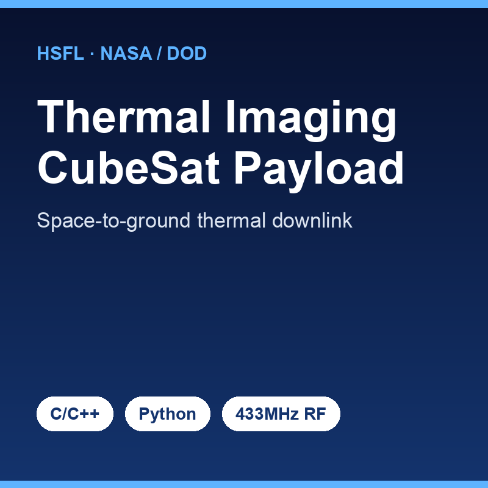

At the [Hawaii Space Flight Laboratory (HSFL)](https://www.hsfl.hawaii.edu/), I lead embedded flight software development for the EPSCoR C3M thermal imaging payload, part of a NASA- and DoD-funded CubeSat effort. The system captures thermal imagery in space using a FLIR/Seek Thermal camera, averages frames on a Raspberry Pi to reduce noise, packetizes the data on a Teensy 4.1 microcontroller, and transmits it to a ground station over a 1-watt 433 MHz UHF radio. On the ground, a second Teensy reassembles the image, validates it with CRC16 checks at both the packet and full-image level, and hands it to a Python CLI that auto-exports the data and renders it with matplotlib.

My role spans the full embedded pipeline. I wrote C/C++ firmware for the UART hand-off between the Raspberry Pi and the satellite Teensy (using a `0xDEADBEEF` magic header to frame messages), the RadioHead-based radio transmission and reception layers, and the packet-tracking logic that detects missing or duplicate packets across an unreliable RF link. On the Python side I built the FLIR Lepton capture toolkit (`readout.py` and a set of viewers) that streams raw thermal frames over USB with libuvc and supports temperature averaging and dataset comparison for payload calibration. I also designed debug and flight modes so the same codebase supports verbose development logging and lean production behavior.

The biggest lesson was learning to engineer for an environment where you get no second chances and no debugger once the hardware is in orbit. Radio links drop packets, so every layer needs error detection, bounded buffers, and graceful recovery rather than assumptions that data arrives intact. Splitting the firmware into clearly separated concerns — capture, packetization, transmission, validation — made the system far easier to reason about and flight-qualify. This project pushed me deep into real-time constraints, hardware/software integration, and the discipline that reliable flight software demands.

Source: <a href="https://github.com/hsfl/epscor-c3m-payload">hsfl/epscor-c3m-payload</a> and <a href="https://github.com/hsfl/epscor-c3m-flirlepton">hsfl/epscor-c3m-flirlepton</a>
