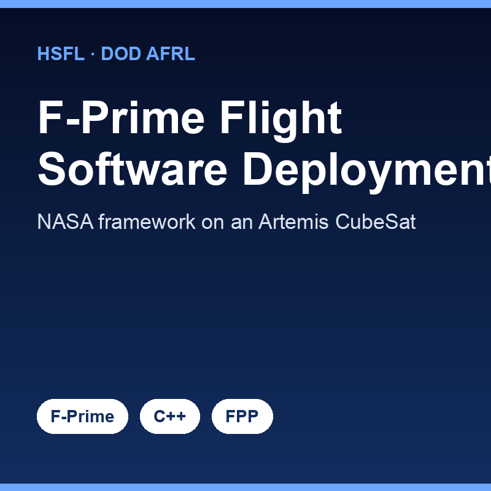

This is the flight software deployment side of my work at the [Hawaii Space Flight Laboratory](https://www.hsfl.hawaii.edu/). I'm integrating [NASA's F-Prime (F') framework](https://nasa.github.io/fprime/) — the same component-based flight software architecture that flew on the Mars Ingenuity helicopter — onto an Artemis CubeSat kit. The end goal is a DoD AFRL-funded dual-satellite constellation flying in a polar orbit, with a target launch in 2029.

F-Prime structures flight software as a topology of components connected by typed ports, with command, telemetry, and event handling built in. My role is building and adapting the deployment: defining components and ports in FPP (the F-Prime Prologue Language), wiring the topology for the Artemis hardware, and connecting it to the rest of the bus — including the power distribution unit and the SatNOGS-COMMS radio. Working inside a mature, flight-proven framework is very different from writing firmware from scratch; the framework gives you structure and guardrails, but you have to learn its conventions deeply to use them correctly.

The big lesson here is the value of standing on a serious framework instead of reinventing one. F-Prime encodes decades of JPL flight-software experience into its component model, and adopting it means inheriting that rigor — ground tooling, testable components, clear interfaces — rather than re-deriving it under deadline. Learning to read a large, established codebase and extend it the way its authors intended has been one of the most directly career-relevant skills I've picked up, and it's exactly the kind of disciplined systems work I want to keep doing in the Space Force.

Source: <a href="https://github.com/hsfl/fprime-artemis-cubesat">hsfl/fprime-artemis-cubesat</a>
