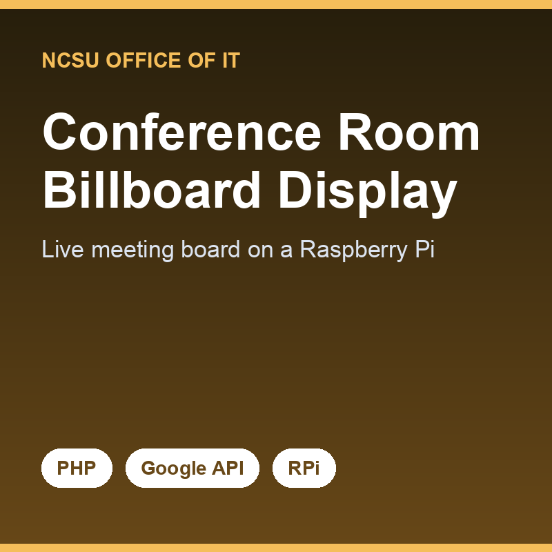

While interning at the [NCSU Office of Information Technology](https://oit.ncsu.edu/) Network Operations Center, I was asked to display upcoming meetings on the building's TVs. Each conference room was bookable through its own Google resource calendar, so staff had to juggle many calendars to see what was happening where. The previous attempt embedded Google Calendar via an iframe, but it showed irrelevant recurring events, didn't scale to TV size, and wasn't responsive — so I rebuilt it from scratch.

I chose PHP for a few deliberate reasons: it was already approved and installed on the Raspberry Pis that would serve the displays, and doing the work server-side kept my personal Google API keys off the client and out of users' hands. Using the Google Calendar PHP API, I gathered each room's unique calendar ID, pulled only the current day's events between 6:00 and 21:00, and wrote a custom sort function (which was genuinely fun to debug) to order them. The events render into `index.php`, and Bootstrap made the board natively responsive and crisp on the 1080p displays.

The project shipped a working, good-looking board, but it also handed me an honest lesson about real-world constraints. I hit a permissions wall: I couldn't read meeting titles on certain private room calendars, and the app leaned on my personal GCP credentials — which shouldn't power shared infrastructure that outlives any one intern. The right fix was an impartial service account, and learning to recognize that kind of architectural and ownership limitation — even when I couldn't fully solve it in my term — was as valuable as the code I shipped.

Source: <a href="https://github.com/sozodennis01/NOC_ConferenceAgenda">sozodennis01/NOC_ConferenceAgenda</a>
