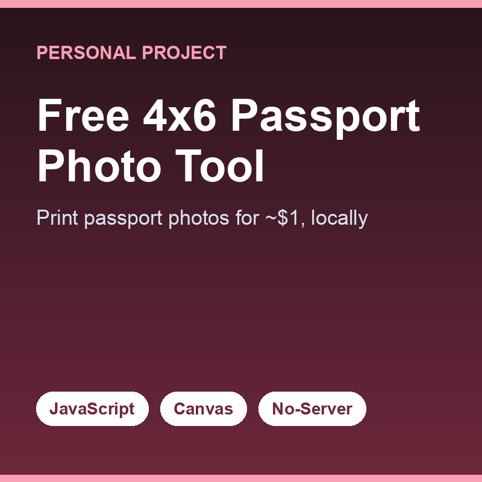

I built this tool while helping my parents renew their passports. I'd taken their photos, but I didn't have a photo printer at home — and I quickly learned you can't just send a single square photo to a drugstore print kiosk. The online converters I found wanted me to upload my parents' photos to their servers, which felt sketchy and unnecessary for something this simple. All I actually needed was to tile one square photo into a 4x6 sheet I could print for under a dollar.

So I made it myself, deliberately with no external libraries — just HTML, CSS, and vanilla JavaScript, with everything running locally in the browser. The app handles the photo upload, accepts only square JPEGs (compressed files keep the size down, and requiring square shape let me skip building a whole image editor), resizes oversized images down to a 1080x1080 max, tiles them into a 4x6 layout using the HTML5 Canvas, lets the user toggle between portrait and landscape, and exports the canvas back out as a downloadable photo. I used the official [U.S. State Department photo tool](https://tsg.phototool.state.gov/photo) to crop the source square, ran it through my app, and printed the result at Walgreens.

The lesson was a quiet but important one: keeping it simple and local was the whole point. By refusing to upload anyone's photos to a server and avoiding dependencies, I ended up with a tool that's private, fast, and still works years later with nothing to maintain. I later found another site that does something similar with a nicer UI — but mine does exactly what my family needed, and building it taught me that the right scope is often much smaller than you think.

Source: <a href="https://github.com/sozodennis01/free-passport-photos-4x6">sozodennis01/free-passport-photos-4x6</a>
