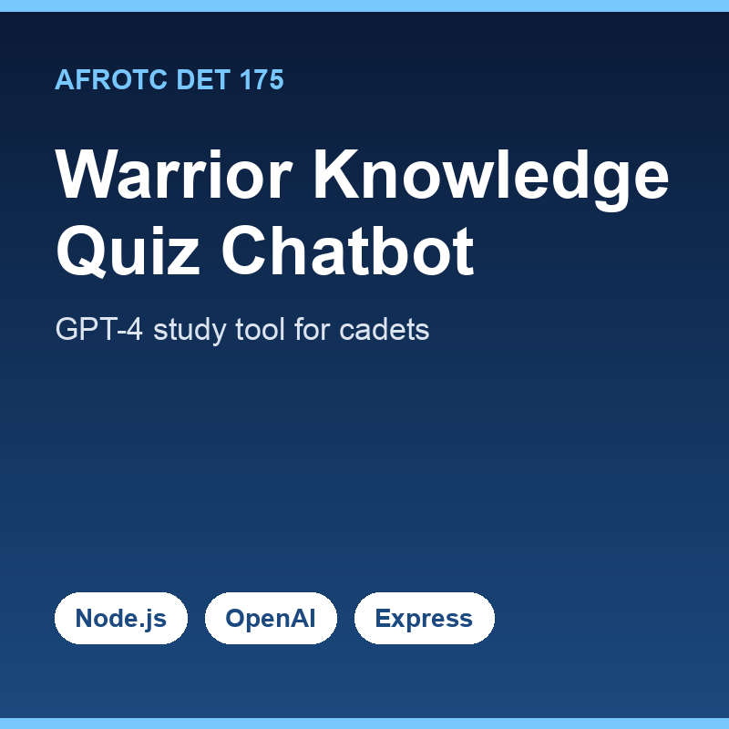

The DET175 Warrior Knowledge Quiz Chatbot is an interactive web app I built to help my fellow Air Force ROTC cadets study the Detachment 175 Cadet Handbook. Memorizing ranks, mission statements, historical facts, and key doctrines is a constant part of cadet life, so I used OpenAI's GPT-4o-mini model to dynamically generate varied, randomized quiz questions from the handbook content. The result is a self-assessment tool that feels different every session instead of a static flashcard list.

I designed and implemented the entire stack myself. The front end is HTML, CSS, and JavaScript with a dark/light toggle and responsive layout; the back end is Node.js and Express talking to the OpenAI API, with per-session chat history so each cadet gets a personalized interaction. Because the app was publicly reachable and backed by a paid API, I added `express-rate-limit` to cap requests per IP and used `dotenv` to keep API keys out of the codebase. I later deprecated and took the app offline on purpose — to prevent prompt-injection abuse and runaway API costs once the underlying model was retired.

This project taught me as much about operating software responsibly as about building it. Wiring up an LLM is the easy part; the harder questions are how you protect a public endpoint, control cost, manage secrets, and decide when to sunset something rather than leave it exposed. Making the deliberate call to shut it down — weighing security and cost against keeping a working demo live — was a genuinely useful engineering and judgment lesson that maps directly to how I think about deploying real systems.

Source: <a href="https://github.com/sozodennis01/Det175WarriorKnowledgeChatBot">sozodennis01/Det175WarriorKnowledgeChatBot</a>
